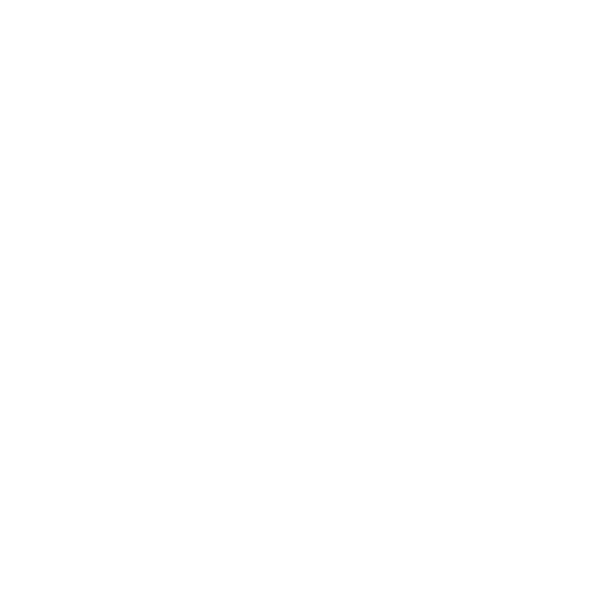

---
[](https://dl.circleci.com/status-badge/redirect/gh/Moon-Garden/moon_garden_be/tree/main)

---

# API Usage
- Base URL:  `https://moon-garden-be.herokuapp.com`
---

#### POST Find/Create a User 
	- This endpoint consumes data returned from Google OAuth, looks for a user, and if no user exists creates one. 

``` ruby
POST: /api/v1/find_or_create_user


PARAMS: 
 - _json: google_OAuth_data.to_json
 - content_type: 'application/json'
```

#### Example

``` ruby 


POST: /v1/find_or_create_user

 - Params: 
	 - _json : "{\"name\":\"Jennifer \",\"email\":\"jennnnnn@gmail.com\",\"unverified_email\":\"jennsssrlhalloran@gmail.com\",\"email_verified\":true,\"first_name\":\"Jennifer\",\"last_name\":\"Halloan\",\"image\":\"https://lh3.googleusercontent.com/a-/AFdZucr_zffBdhJaydFkdXeeHkhe2BzmVNKGIE-Ozwh=s96-c\"}"
```

RESPONSE:

![[Screen Shot 2022-07-29 at 11.12.50 AM.png]]
